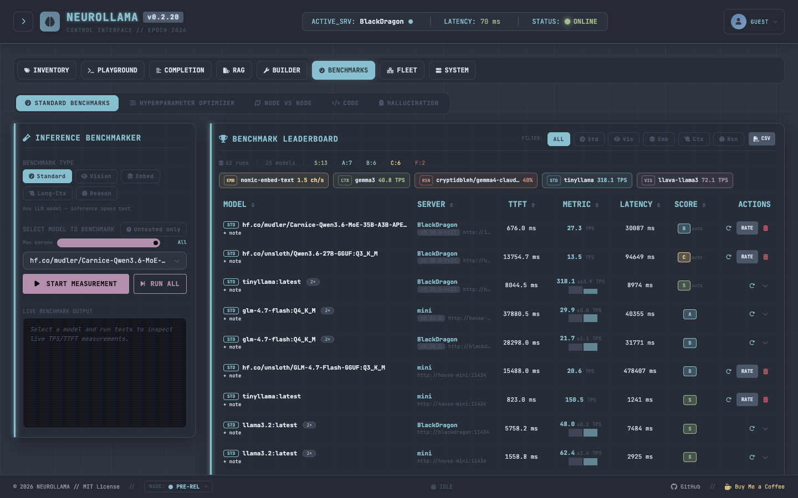
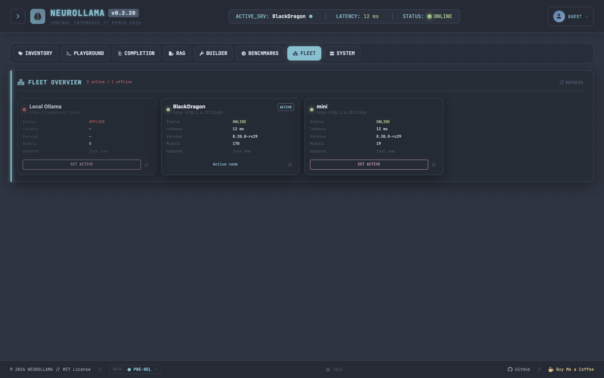

<p align="center">
  
</p>

<p align="center">
  <strong>A cybertech-inspired web control center for managing local & remote Ollama nodes.</strong>
</p>

<p align="center">
  
  <a href="https://golang.org/"></a>
  <a href="https://tailwindcss.com/"></a>
  <a href="https://daisyui.com/"></a>
  <a href="https://github.com/notfixingit3/neurollama/blob/main/LICENSE"></a>
  <a href="https://buymeacoffee.com/notfixingit"></a>
</p>

> [!WARNING]
> **Pre-release software.** NEUROLLAMA is under active development and has not reached a stable release. Features may be incomplete, broken, or change without notice. Running this software may trigger cascading failures in your local Ollama setup, spontaneous model downloads, existential dread, or other unforeseeable consequences. We are not responsible for lost models, corrupted databases, rogue AI agents, or the heat death of your GPU. Use at your own risk. You have been warned.

> [!CAUTION]
> **Ollama Cloud models (`:cloud` suffix) incur real costs.** Any model whose name ends in `:cloud` (e.g. `deepseek-v4-pro:cloud`) is routed through Ollama Cloud and billed per token. Running benchmarks, hallucination tests, or code evaluations against these models **will generate API charges**. Exclude `:cloud` models from any automated or batch benchmark run unless you intend to pay for the usage.

---

## 🌌 Overview

**NEUROLLAMA** is a lightweight, self-hosted web control panel that provides a beautiful, techy interface to connect, monitor, and query your Ollama instances. Styled using the **Nord Palette** and built with **Go (Gin)** and **Tailwind CSS/daisyUI**, it is designed to look like a futuristic command console.

With NEUROLLAMA you can manage multiple Ollama nodes, inspect VRAM telemetry, benchmark models across five test types plus two dedicated deep-eval suites, run multi-language code generation tests with live syntax checking, probe hallucination resistance, build custom models, and more — all from a single binary with zero runtime dependencies.

> **What NEUROLLAMA is not:** the primary goal is model management, evaluation, and diagnostics — not day-to-day chat. A TTY0 Chat Playground is included for quick testing and prompt exploration, but if you are looking for a full-featured conversational interface, dedicated tools like **[Open WebUI](https://github.com/open-webui/open-webui)** or **[AnythingLLM](https://github.com/Mintplex-Labs/anything-llm)** will serve you better for that purpose.

---

## 📸 Screenshots

<p align="center">
  
</p>

<p align="center">
  
  
</p>

---

## ⚡ Key Features

### 🌐 Multi-Node Registry
Register, edit, test, and hot-swap between multiple local or remote Ollama server nodes. Credential values are redacted from API responses. Real-time background telemetry shows active-server latency, online status, and version channel (STABLE / PRE-REL). Set a manual GPU VRAM capacity per node to anchor telemetry bars when Ollama's API cannot report it.

The **Node selector** lives in the footer status bar as a bordered pill badge — click it and a popover appears directly above the button showing all registered nodes with their status, Ollama version, latency, and a one-click **SET** button.

### 📦 Model Hub & Model List
- View all installed models with parameters, size, quantization, and serialization details.
- **Sortable columns**: click any column header (Name, Size, Parameters, Modified) to sort ascending/descending. Sort state persists across page navigations.
- **Multi-select**: check individual rows or use Select All (current page) with a "Select all N" shortcut for multi-page inventories. Batch delete with one click; deselect via the CLEAR button.
- **Trained context-length badge** shown in every model dropdown: e.g. `128K ctx`, `40K ctx`. Sourced from Ollama's `/api/show` model info in parallel at startup.
- **Benchmark grade badges** on every inventory row: compact colour-coded badges show the model's best standard grade (S/A/B/C/F), code benchmark grade, and hallucination recall % — all sourced from your local benchmark history at a glance. Badges refresh automatically after any benchmark run completes.
- **Capability badges** — **VIS** (vision/multimodal), **EMB** (embedding), **TOOLS** (function calling), **THINK** (chain-of-thought reasoning) — sourced from Ollama's `/api/show` `capabilities` field where available, with heuristic fallback for older Ollama versions.
- Inspect full Modelfiles, templates, parameters, system prompts, and sanitized model cards with raw/source view controls.
- **Modelfile Fix Wizard**: click the **FIX** button in any model's inspect panel (or the **CHAT** badge in the leaderboard) to open a guided editor — clear or replace the SYSTEM prompt, preview the generated Modelfile, and create the fixed model in one step. Useful for models with hardcoded greeting responses.
- Unified **Model Hub** panel: pull directly from the **Ollama Library** or **Hugging Face** (GGUFs) with real-time download speed and progress bars. Browse a curated 35-model catalog filterable by category, source, and capabilities.

### 💬 TTY0 Chat Playground
> **Note:** Chat is included for quick model testing and prompt exploration — not as a replacement for dedicated chat applications. For day-to-day conversational use, consider [Open WebUI](https://github.com/open-webui/open-webui) or similar tools.

- Custom terminal-style playground to interact with your models.
- Save, load, and edit custom **System Prompt Presets** persisted to SQLite.
- Real-time parameter controls: Temperature, Context Limit, Top K, Top P, Seed, Repeat Penalty, hardware allocation, and generation limits.
- Stop in-flight generations and restore the last failed prompt for quick retry.
- **🧠 Render Thinking Toggle**: hide/show reasoning tracks (`<think>` blocks) from DeepSeek R1, QwQ, and other reasoning models.
- Searchable model select with param-size badge and trained context-length badge inline.

### 🛠️ Model Builder
- Create new customized models using a graphical interface — compiles a Modelfile from your base model, system prompt, temperature, and custom parameters.
- Real-time build-progress logs stream to the UI with cancellation support.

### 📼 Memory Telemetry
- View which models Ollama currently has loaded, their sizes, and GPU VRAM vs system RAM allocation.
- Live canvas chart tracking **Host CPU**, **Host RAM**, and **Ollama VRAM** over time, anchored to the node's configured VRAM capacity.
- **Loaded model indicator** pinned to the footer: shows model name, param size, quantization, and VRAM used/total (e.g. `gemma3 12B Q4_K_M · 5.9G/24G`). One-click eject with confirmation.
- SYS RAM row shows **"Local Ollama only"** when the active node is remote.

### 📈 Standard Benchmarks
Five benchmark types: **Standard** (TPS), **Vision** (multimodal TPS), **Embedding** (chunks/sec), **Long-Context** (TPS + degradation %), and **Reasoning** (accuracy %).

- Model select auto-filtered to match the selected benchmark type.
- Sortable leaderboard with clickable headers, per-type filtering, letter-score ratings (S/A/B/C/D/F), and inline notes.
- **Inline note editing**: click any note area on a leaderboard row (summary or sub-run) to edit in-place — Enter/blur saves, Escape cancels.
- **TPS sparkline** on multi-run rows: tiny SVG bar chart in the metric cell shows the trend across all runs (oldest → newest, latest bar highlighted).
- **Run All** button queues all compatible models for the selected benchmark type and runs them sequentially with a live `N/total · modelname` progress indicator.
- **Retest** button on each leaderboard row: switches tab, pre-selects model and type, and starts the run.
- Models are automatically evicted from VRAM after every benchmark run so the next model starts with a clean slate.

### 💻 Code Benchmark
Evaluate a model's code-generation capability across up to 12 languages simultaneously.

**Thinking-model aware**: Qwen3, QwQ, DeepSeek-R1, and similar chain-of-thought models are automatically detected. A `/no_think` suffix is injected into the prompt and `think: false` is sent in the API request to suppress reasoning tokens during benchmark runs, preventing KV-cache bloat and misleading latency numbers.

**Python · Go · JavaScript · TypeScript · Node.js · Bash · sh · PHP · Ruby · Rust · C · SQL**

- Each language receives a real algorithmic task (not toy examples). The model writes the solution; a syntax checker validates it; a second AI judge scores quality 1–10.
- **Syntax Checker Status Panel**: live green/red badges in the config area show which checkers are available on your system. Hover any badge for the exact binary name and install command.
- **Context Window (num_ctx) selector**: choose from Model Default → 4K → 128K. Defaults to 16K to prevent KV-cache bloat across 12 sequential runs.
- **Language filter**: run only the languages you care about.
- **Leaderboard**: top-3 models per language shown with 🥇🥈🥉 medals; full run history with expandable per-language detail rows.
- **Stopwatch timer** in the console header during active runs.
- Models are unloaded from VRAM after each full run.

#### Syntax checker dependencies
The following optional binaries extend checker coverage:

| Language | Binary | Install |
|---|---|---|
| Python | `python3` | `brew install python` / [python.org](https://python.org) |
| Go | built-in | always available |
| JavaScript | `node` | `brew install node` / [nodejs.org](https://nodejs.org) |
| TypeScript | `deno` | `brew install deno` / [deno.com](https://deno.com) |
| Node.js | `node` | same as JavaScript |
| Bash | `bash` | pre-installed on macOS/Linux |
| sh (POSIX) | `sh` | pre-installed on macOS/Linux |
| PHP | `php` | `brew install php` / [php.net](https://php.net) |
| Ruby | `ruby` | `brew install ruby` / [ruby-lang.org](https://ruby-lang.org) |
| Rust | `rustc` | `curl --proto '=https' --tlsv1.2 -sSf https://sh.rustup.rs \| sh` / [rustup.rs](https://rustup.rs) |
| C | `gcc` | `brew install gcc` / `xcode-select --install` / `apt install build-essential` |
| SQL | `sqlfluff` | `pip install sqlfluff` / `brew install sqlfluff` / [sqlfluff.com](https://sqlfluff.com) |

> Languages without their checker binary will still run generation and AI-judge scoring — syntax validation is simply skipped with a console note.

### 🧠 Hallucination Benchmark
Probe a model's resistance to confabulation by testing fact-recall across increasing context-window sizes.

- Feed the model a knowledge document, then ask factual questions about it at progressively larger context lengths (up to a configurable max).
- Each answer is classified as **PASS** (correct recall), **HALLUCINATION** (plausible but wrong), or **REFUSAL** (model declined to answer).
- **Heat-map grid**: rows = context sizes, columns = document positions (10% / 50% / 90%) — colour-coded green/red/amber. Each cell shows the result symbol and the **total generation time** for that test. Hover for a rich tooltip: status, TTFT, total time, and the model's exact response.
- **Chat-only model detection**: if a model outputs a greeting ("I'm ready to help!") instead of answering, the run is flagged **CHAT_MODEL** and skipped rather than wasting judge cycles. A **CHAT** badge appears in the leaderboard — click it to open the Modelfile Fix Wizard.
- **Leaderboard**: ranked by maximum context at which the model maintained accurate recall.
- **Stopwatch timer** in the console header during active runs.

### 🔍 Hyperparameter Optimizer
Sweep inference parameters (temperature, top-k, top-p, repeat-penalty, etc.) over a configurable search space and score each combination. Useful for tuning a model for a specific task without manual trial-and-error.

### 📚 RAG (Retrieval-Augmented Generation)
- Upload PDF or text documents, chunk and index them into a local SQLite-backed vector store.
- Query the knowledge base with similarity search and inject retrieved context directly into chat.

### ⚙️ Settings
- **Model Update Scheduler**: configure automatic background checks for model updates at custom intervals with live log streaming.

### 🩺 Preflight Diagnostics
Validate SQLite, data-directory writability, static assets, active Ollama reachability, model inventory access, settings, and streaming route readiness — all from one panel.

---

## 🎨 UI / UX Details

- **User preferences badge** in the header: click the avatar to open a dropdown for **Dark / Light / System** theme selection. Preference is persisted to the database. An anti-FOUC inline script in `<head>` applies the saved theme before the first paint.
- **Searchable select widget** on all model dropdowns: type to filter, keyboard-navigable, shows param-size badge + trained context-length badge inline.
- **Hover tooltips**: cursor-following styled tooltips (Nord dark, font-mono) on capability badges, benchmark grade badges, TPS sparklines, sort headers, context warnings, and action buttons. Add `data-tip="..."` to any element to opt in.
- **Fixed layout**: header and footer always visible — workspace content scrolls independently.
- Instantly toggle Node Registry, Chat History, and Config sidebars; preferences persist in localStorage.
- Nord colour palette throughout: Polar Night backgrounds, Snow Storm text, Frost blue accents.
- **Untested only filter** on Node vs Node, Code Benchmark, and Hallucination tabs: toggle to show only models that have no prior runs of that benchmark type. Automatically refreshes after each completed run so newly-tested models drop off immediately.
- **Context-size warning (⚠)** on chat and code bench ctx selects: appears when the chosen `num_ctx` exceeds the model's trained context length, with a tooltip explaining Ollama will silently clamp it.
- **RAG embedding model selector** groups embedding-capable models at the top of the select, making it immediately clear which models produce valid embeddings.

---

## 🛠️ Tech Stack

| Layer | Technology |
|---|---|
| Backend | Go 1.26.3, [Gin](https://github.com/gin-gonic/gin) |
| Database | SQLite via `modernc.org/sqlite` (CGO-free) |
| Frontend | Vanilla HTML5/JS (ES6), no framework |
| CSS | Tailwind CSS v4 (standalone CLI), DaisyUI v5, Nord theme |
| Icons | Font Awesome 6 |
| Streaming | Fetch API + Server-Sent Events (SSE) |

---

## 🚀 Quick Start

### Prerequisites

- [Go](https://go.dev/doc/install) 1.26.3+
- A running [Ollama](https://ollama.com/) instance. For remote nodes, start Ollama with:
  ```bash
  OLLAMA_ORIGINS="*" ollama serve
  ```
- **Node.js is not required.** CSS is pre-compiled and committed. See [Rebuilding CSS](#rebuilding-css) only if you modify styles.

### Installation

```bash
git clone https://github.com/notfixingit3/neurollama.git
cd neurollama
go build -o neurollama .
./neurollama
```

Open **`http://localhost:8811`** in your browser.

### Pre-built binaries

Download the latest release binary for your platform from the [Releases](https://github.com/notfixingit3/neurollama/releases) page:

| Platform | Binary |
|---|---|
| macOS Apple Silicon | `neurollama-darwin-arm64` |
| macOS Intel | `neurollama-darwin-amd64` |
| Linux x86-64 | `neurollama-linux-amd64` |
| Linux ARM64 | `neurollama-linux-arm64` |

```bash
chmod +x neurollama-*
./neurollama-darwin-arm64   # example
```

---

## 🎨 Rebuilding CSS

The compiled `static/css/output.css` is committed — only rebuild if you modify `tailwind/input.css` or templates.

Uses the [Tailwind CSS v4 standalone CLI](https://tailwindcss.com/blog/standalone-cli) — **no Node.js or npm required**.

**One-time binary download (macOS arm64):**
```bash
curl -sL https://github.com/tailwindlabs/tailwindcss/releases/download/v4.3.0/tailwindcss-macos-arm64 -o tailwindcss && chmod +x tailwindcss
```

Replace `macos-arm64` with `macos-x64`, `linux-x64`, `linux-arm64`, or `windows-x64.exe` for other platforms.

**Build:**
```bash
./tailwindcss -i tailwind/input.css -o static/css/output.css --minify
```

**Watch mode:**
```bash
./tailwindcss -i tailwind/input.css -o static/css/output.css --watch
```

---

## ⚙️ Configuration & Data Storage

- **SQLite Database**: stored in `data/neurollama.db` (created automatically on first launch). Holds server registry, chat history, RAG index metadata, benchmark results, and prompt presets.
- **Legacy migration**: if `data/ollama-manager.db` exists and `data/neurollama.db` does not, NEUROLLAMA renames the old file on startup.
- **Credentials**: bearer tokens, Basic Auth passwords, and custom header values are stored locally and redacted from API responses.
- **Custom port**:
  ```bash
  PORT=9000 ./neurollama
  ```

---

## 🐳 Docker

The Dockerfile uses a two-stage build. No Node/npm steps — CSS is pre-compiled.

```dockerfile
# builder
FROM golang:1.26.3-alpine AS builder
WORKDIR /app
COPY . .
RUN go build -ldflags="-s -w" -o neurollama .

# runtime
FROM alpine:latest
WORKDIR /app
COPY --from=builder /app/neurollama .
COPY --from=builder /app/templates ./templates
COPY --from=builder /app/static ./static
EXPOSE 8811
CMD ["./neurollama"]
```

---

## 🤝 Contributing

All commit messages must end with a random Scooby-Doo quote. This is non-negotiable.

```
feat: add hallucination benchmark heat-map

"Zoinks!"
```

---

## 💬 Support

If you find NEUROLLAMA helpful, feel free to open issues, submit pull requests, or buy me a coffee!

<p align="left">
  <a href="https://buymeacoffee.com/notfixingit" target="_blank">
    
  </a>
</p>

---

## 🙏 Credits

NEUROLLAMA is built on the shoulders of the following open-source projects. Thank you to every maintainer and contributor.

### Go libraries

| Library | Purpose | License |
|---|---|---|
| [gin-gonic/gin](https://github.com/gin-gonic/gin) | HTTP web framework | MIT |
| [glebarez/go-sqlite](https://github.com/glebarez/go-sqlite) | CGO-free SQLite driver | MIT |
| [modernc.org/sqlite](https://gitlab.com/cznic/sqlite) | Pure-Go SQLite engine | BSD-3-Clause |
| [ledongthuc/pdf](https://github.com/ledongthuc/pdf) | Server-side PDF text extraction | MIT |
| [dustin/go-humanize](https://github.com/dustin/go-humanize) | Human-readable sizes & numbers | MIT |
| [google/uuid](https://github.com/google/uuid) | UUID generation | BSD-3-Clause |
| [bytedance/sonic](https://github.com/bytedance/sonic) | High-performance JSON codec (Gin dep) | Apache 2.0 |
| [goccy/go-json](https://github.com/goccy/go-json) | Fast JSON encoder/decoder (Gin dep) | MIT |
| [go-playground/validator](https://github.com/go-playground/validator) | Request validation (Gin dep) | MIT |
| [ugorji/go/codec](https://github.com/ugorji/go) | Codec library (Gin dep) | MIT |

### Frontend & CSS

| Library | Purpose | License |
|---|---|---|
| [Tailwind CSS v4](https://tailwindcss.com) | Utility-first CSS framework | MIT |
| [DaisyUI v5](https://daisyui.com) | Tailwind component library (Nord theme) | MIT |
| [Font Awesome 6](https://fontawesome.com) | Icons (Free tier) | Icons: CC BY 4.0 · Fonts: SIL OFL 1.1 · Code: MIT |
| [marked.js](https://github.com/markedjs/marked) | Client-side Markdown rendering | MIT |
| [PDF.js](https://github.com/mozilla/pdf.js) | Client-side PDF parsing (vendored) | Apache 2.0 |

### Fonts

| Font | Usage | License |
|---|---|---|
| [JetBrains Mono](https://www.jetbrains.com/lp/mono/) | Monospace UI font | SIL Open Font License 1.1 |
| [Outfit](https://fonts.google.com/specimen/Outfit) | Display / heading font | SIL Open Font License 1.1 |

---

## 📄 License

This project is licensed under the [MIT License](LICENSE).
