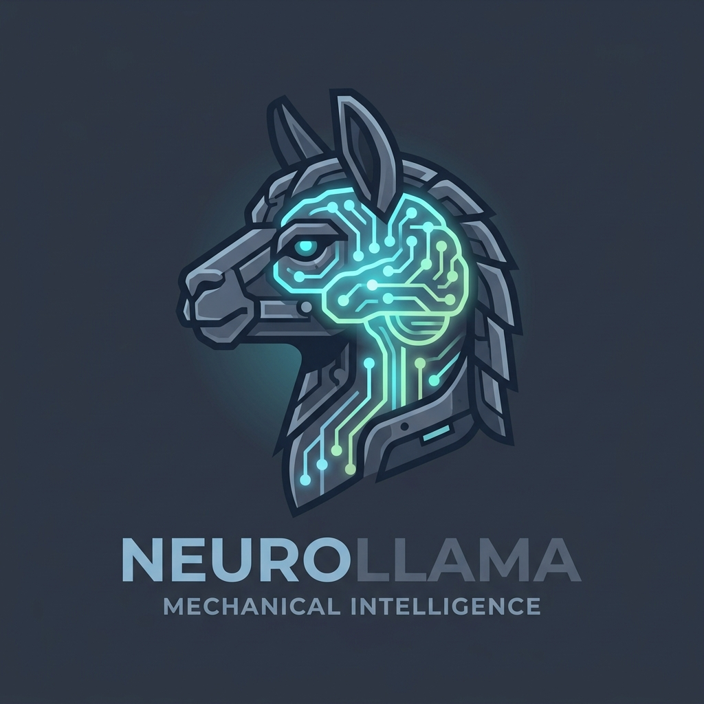
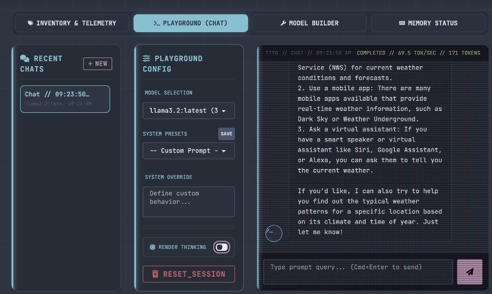

<p align="center">
  
</p>

<p align="center">
  <strong>A cybertech-inspired web control center for managing local & remote Ollama nodes.</strong>
</p>

<p align="center">
  
  <a href="https://golang.org/"></a>
  <a href="https://tailwindcss.com/"></a>
  <a href="https://daisyui.com/"></a>
  <a href="https://github.com/notfixingit3/neurollama/blob/main/LICENSE"></a>
  <a href="https://buymeacoffee.com/notfixingit"></a>
</p>

> [!WARNING]
> **Pre-release software.** NEUROLLAMA is under active development and has not reached a stable release. Features may be incomplete, broken, or change without notice. Running this software may trigger cascading failures in your local Ollama setup, spontaneous model downloads, existential dread, or other unforeseeable consequences. We are not responsible for lost models, corrupted databases, rogue AI agents, or the heat death of your GPU. Use at your own risk. You have been warned.

---

## 🌌 Overview

**NEUROLLAMA** is a lightweight, self-hosted web control panel that provides a beautiful, techy interface to connect, monitor, and query your Ollama instances. Styled using the **Nord Palette** and built with **Go (Gin)** and **Tailwind CSS/daisyUI**, it is designed to look like a futuristic command console.

With NEUROLLAMA, you can connect to multiple local or remote servers, inspect which models are currently loaded in memory, inspect model parameters/configs, build new models using custom Modelfiles, run diagnostics, benchmark models across multiple test types, and chat with models inside a premium Terminal Emulator Playground.

---

## 📸 Screenshots

<p align="center">
  
</p>

---

## ⚡ Key Features

- **🌐 Multi-Node Registry**: Register, edit, test, and swap between multiple local or remote Ollama server nodes. Credential values are redacted from API responses, and real-time background telemetry shows active server latency, online status, and version. Set a manual GPU VRAM capacity per node — used to scale VRAM bars and the loaded model indicator when Ollama's API cannot report it.

- **📦 Model Hub & Inventory**:
  - View all installed models with parameters, size, and serialization details.
  - Capability badges (**VIS** / **EMB**) on inventory rows and catalog cards — detected from model family metadata and name heuristics.
  - Inspect full Modelfiles, templates, parameters, system prompts, and sanitized external model cards with raw/source view controls.
  - Unified **Model Hub** panel: pull directly from the **Ollama Library** or **Hugging Face** (GGUFs) with real-time download speed and progress bars. Browse a curated 35-model catalog filterable by category, source, and capabilities.
  - Batch select and delete multiple models.

- **💬 TTY0 Chat Playground**:
  - Custom terminal-style playground to interact with your models.
  - Save, load, and edit custom **System Prompt Presets** persisted to SQLite.
  - Real-time parameter controls: Temperature, Context Limit, Top K, Top P, Seed, Repeat Penalty, hardware allocation, and generation limits.
  - Stop in-flight generations and restore the last failed prompt for quick retry.
  - **🧠 Render Thinking Toggle**: Instantly hide/show reasoning tracks (`<think>` blocks) from DeepSeek R1 and other reasoning models.

- **🛠️ Model Builder**:
  - Create new customized models using a simple graphical interface.
  - Automatically compiles a Modelfile from your base model, system prompt, temperature, and custom parameters.
  - Real-time build progress logs stream directly to the UI, with cancellation support.

- **📼 Memory Telemetry**:
  - View which models Ollama currently has loaded, their sizes, and GPU VRAM vs system RAM allocation — sourced from Ollama's `/api/ps` endpoint.
  - Live canvas chart tracking **Host CPU**, **Host RAM**, and **Ollama VRAM** over time. Chart scale is anchored to the node's configured VRAM capacity when set.
  - **Loaded model indicator** pinned to the footer status bar: shows model name, parameter size, quantization level, and VRAM used/total (e.g. `gemma3 12B Q4_K_M · 5.9G/24G`). Includes a one-click eject button with confirmation.
  - SYS RAM row shows **"Local Ollama only"** when the active node is remote, since that metric is only meaningful on the host machine.
  - ⚠️ **Remote node limitation**: Ollama's API does not expose total VRAM capacity or GPU utilization. For remote servers, loaded model sizes are shown accurately but VRAM percentage bars are relative to any manually configured VRAM value (or hidden if none is set).

- **📈 Benchmarks**:
  - Five benchmark types: **Standard** (TPS), **Vision** (multimodal TPS), **Embedding** (chunks/sec), **Long-Context** (TPS + degradation %), and **Reasoning** (accuracy %).
  - Model select is automatically filtered to models that match the selected benchmark type (vision models for Vision, embedding models for Embed, etc.).
  - Sortable leaderboard with clickable column headers, per-type filtering, letter score ratings, and inline notes.
  - **Retest** button (↻) on each leaderboard row: switches to Benchmark tab, pre-selects the correct type and model, and starts the run automatically.
  - Hyperparameter Optimizer for tuning inference parameters.

- **⚙️ Settings**:
  - **Model Update Scheduler**: configure automatic background checks for model updates at custom intervals. Logs are streamed live.

- **🩺 Preflight Diagnostics**:
  - Validate SQLite, data directory writability, static assets, active Ollama reachability, model inventory access, settings, and streaming route readiness.

- **📐 Fixed Layout**:
  - Header and footer are always visible — workspace content scrolls independently between them.
  - Instantly toggle Node Registry, Chat History, and Config sidebars to optimize screen width. Layout settings persist in local browser storage.

---

## 🛠️ Tech Stack

* **Backend**: Go 1.26.3 (powered by [Gin Web Framework](https://github.com/gin-gonic/gin))
* **Database**: SQLite3 (via `modernc.org/sqlite` for CGO-free compilations)
* **Frontend**: Vanilla HTML5/JS (ES6), Tailwind CSS v4, daisyUI v5 (Nord theme), FontAwesome icons
* **Streaming**: Fetch API + EventSource/SSE for model downloads, builds, benchmarks, and telemetry

---

## 🚀 Quick Start

### Prerequisites

* [Go](https://go.dev/doc/install) 1.26.3.
* A running [Ollama](https://ollama.com/) instance (ensure the server has origin permissions enabled if running remotely; typically start Ollama with `OLLAMA_ORIGINS="*" ollama serve`).
* **Node.js is not required.** CSS is pre-compiled and committed. See [Rebuilding CSS](#rebuilding-css) only if you modify styles.

### Installation

1. **Clone the repository**:
   ```bash
   git clone https://github.com/notfixingit3/neurollama.git
   cd neurollama
   ```

2. **Compile the Go binary**:
   ```bash
   go build -o neurollama .
   ```

3. **Run the server**:
   ```bash
   ./neurollama
   ```
   The application will start on: **`http://localhost:8080`**

---

## 🎨 Rebuilding CSS

The compiled `static/css/output.css` is committed to the repo — you only need this if you modify `tailwind/input.css` or templates.

CSS is built using the [Tailwind CSS v4 standalone CLI](https://tailwindcss.com/blog/standalone-cli) — **no Node.js or npm required**.

**One-time binary download (macOS arm64):**
```bash
curl -sL https://github.com/tailwindlabs/tailwindcss/releases/download/v4.3.0/tailwindcss-macos-arm64 -o tailwindcss && chmod +x tailwindcss
```

For other platforms replace `macos-arm64` with `macos-x64`, `linux-x64`, `linux-arm64`, or `windows-x64.exe`.

**Build:**
```bash
./tailwindcss -i tailwind/input.css -o static/css/output.css --minify
```

**Watch mode (auto-rebuild on save):**
```bash
./tailwindcss -i tailwind/input.css -o static/css/output.css --watch
```

---

## ⚙️ Configuration & Data Storage

- **SQLite Database**: App configurations, servers registry, chat history, RAG index metadata, diagnostics settings, and prompt presets are stored in `data/neurollama.db` (created automatically on first launch).
- **Legacy Database Migration**: If `data/ollama-manager.db` exists and `data/neurollama.db` does not, NEUROLLAMA renames the old database file on startup.
- **Server Credentials**: Bearer tokens, Basic Auth passwords, and custom header values are stored locally for node access but are redacted from normal server-list API responses.
- **Environment Variables**:
  - `PORT`: Set a custom port for the server (defaults to `8080`).
    ```bash
    PORT=9000 ./neurollama
    ```

---

## 🤝 Contributing

All commit messages must end with a random Scooby-Doo quote. This is non-negotiable.

```
feat: add VRAM telemetry panel

"Zoinks!"
```

## 💬 Support & Contributions

If you find this manager helpful, feel free to submit pull requests, open issues, or buy me a coffee!

<p align="left">
  <a href="https://buymeacoffee.com/notfixingit" target="_blank">
    
  </a>
</p>

---

## 📄 License

This project is licensed under the [MIT License](LICENSE) - see the LICENSE file for details.
